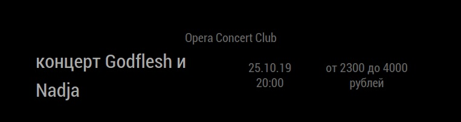

## MMM-KudaGo

Module for [MagicMirror](https://github.com/MichMich/MagicMirror). Can show upcoming events (concerts, theater plays, exhibitions and etc.), that collected from [KudaGo](https://kudago.com). 

Actual for only **Russian Federation** and **Ukraine**, because of limitations in information, provided by service. Below, in config description, is the list of available locations.

## Screenshot



### Dependencies
* [MagicMirror](https://github.com/MichMich/MagicMirror)
* [python-shell](https://www.npmjs.com/package/python-shell)
* Python 3.6 or higher

### Installation
Navigate into your MagicMirror's modules folder
```markdown
cd ~/MagicMirror/modules
```

Clone this module repository:
```markdown
git clone https://github.com/polarbearjngl/MMM-KudaGo.git
```

Navigate to the new MMM-KudaGo folder and install the npm **python-shell** dependency
```markdown
npm install python-shell
```

Check that you have installed **Python 3.6 or higher** on your Raspberry. Just write in console `python3`, and if it exists, you will see python terminal. If not, you need to install it with this line
```markdown
sudo apt-get install python3
```

Then install required packages from requirements.txt
```markdown
sudo python3 -m pip install -r requirements.txt
```

### Configuration
Here is example of config, that must be placed in *config.js* file in array *modules*
```markdown
{
    module: 'MMM-KudaGo',               //module name
    disabled: false,                    //false if you want turn on module
    position: 'bottom_bar',             //the best is bottom
    config: {
                location: "spb",        //city for searching events. String with only one value, without comma. More info in readme.md
                categories: "concert",  //Types of events, separated by comma, that will requested from KudaGo. More info in readme.md
                tags: "рок и рок-н-ролл,метал", //Tags for events, separated by comma, for much more relevant search. More info in readme.md
                days: 7                 //Number of days, for creating interval for search (since today until target days)
            }
},
```

### The following properties can be configured through config.js:

 Option | Type | Description
-------|------|-----------
`days` | Int | Number of days, for creating interval for search (since today until target days).
`nextEventInterval` | Int | Interval for changing current text. Defaults is 10 sec (`10000`).
`updateInterval` | Int | Interval for writes and reads the file. Defaults is every 6 hours (`6 * 3600 * 1000`).
`animationSpeed` | Float | Speed of text fading and changing to next. Defaults is 2.5 sec (`2.5 * 1000`).
`pythonPath` | String | Shell comand or path to Python binary. Default is `python3`.
`location` | String | City for searching events. Must be string with only one value, without comma. Possible values: <ul><li>St. Petersburg: `spb`,</li><li>Moscow: `msk`,</li><li>Novosibirsk: `nsk`,</li><li>Yekaterinburg: `ekb`,</li><li>Nizhny Novgorod: `nnv`,</li><li>Kazan: `kzn`,</li><li>Samara: `smr`,</li><li>Krasnodar: `krd`,</li><li>Sochi : `sochi`,</li><li>Ufa: `ufa`,</li><li>Krasnoyarsk: `krasnoyarsk`,</li><li>Kiev: `kev`</li></ul>
`categories` | String | Types of events, one word or separated by comma, that will requested from KudaGo. Default is `concert`. **All possible values**: `concert`, `theater`, `party`, `exhibition`, `festival`, `show`, `games`, `night`, `evening`, `quest`, `stand_up`, `ball`, `business_events`, `circus`, `comedy_club`, `dance_trainings`, `education`, `entertainment`, `flashmob`, `holiday`, `kids`, `kvn`, `magic`, `masquerade`, `meeting`, `open`, `other`, `permanent_exhibitions`, `photo`, `presentation`, `recreation`, `romance`, `sale`, `social_activity`, `speed_dating`, `sport`, `tour`, `yarmarki`, `yoga`. Description for possible types of events see on [This Page](https://github.com/polarbearjngl/MMM-KudaGo/blob/b148f9b4de9ffb1098ac83b2788089c7802165d2/kudago/api/entities/event.py#L61)
`tags` | String | Tags for events, separated by comma, for much more relevant search. If value is not empty, module will show only events that have one or more of this tags in their description. Default is empty string. See details below.

<details>
<summary><h3>List of possible tags (click to expand)</h3></summary>

# Tags on russian
* `12+`,
* `16+`,
* `18+`,
* `6+`,
* `8 марта`,
* `cовременные художники`,
* `free`,
* `open air`,
* `r&b`,
* `абстрактное искусство`,
* `абсурд`,
* `авангард`,
* `авангард и экспериментальная`,
* `авто-мото`,
* `автобусные`,
* `авторская`,
* `авторские`,
* `актерское мастерство`,
* `активный зимний отдых`,
* `активный отдых`,
* `акции и скидки`,
* `александр вертинский`,
* `альтернатива`,
* `арт-терапия`,
* `архитектура и дизайн`,
* `балет`,
* `банкетные залы`,
* `барокко`,
* `бесплатно`,
* `бизнес-образование`,
* `бомарше`,
* `брейк-данс`,
* `бродский`,
* `бронза`,
* `булгаков`,
* `быстрые свидания`,
* `быстрые свидания (развлечения)`,
* `быт`,
* `в свободное время`,
* `веревочные парки`,
* `веселье`,
* `весенние каникулы`,
* `вечером`,
* `виртуальная реальность`,
* `витражи`,
* `вкусно`,
* `водевиль`,
* `водные`,
* `военная драма`,
* `вокальная музыка`,
* `волшебство`,
* `всей семьей`,
* `встречи`,
* `выпускной`,
* `выставки`,
* `выставки для детей`,
* `выставочные пространства`,
* `выходные`,
* `выходные с детьми`,
* `ганс христиан андерсен`,
* `гастрономические события`,
* `гоголь`,
* `горные лыжи`,
* `городские`,
* `городские квесты`,
* `городские прогулки`,
* `гравюра`,
* `дворы-колодцы`,
* `день космонавтики`,
* `дети`,
* `дети на каникулах`,
* `детские`,
* `детские концерты`,
* `детские спектакли`,
* `детство`,
* `детям`,
* `джаз и блюз`,
* `дизайн`,
* `дистанционное обучение`,
* `для детей`,
* `для женщин`,
* `для мужчин`,
* `дни открытых дверей`,
* `добро`,
* `достоевский`,
* `дошкольники`,
* `драматические постановки`,
* `другой петербург`,
* `евгений онегин`,
* `естественные науки`,
* `женщина`,
* `животные`,
* `животные и птицы`,
* `за городом`,
* `загородные прогулки`,
* `занятия танцами (раздел отдых)`,
* `зимние развлечения`,
* `знакомства`,
* `знаменитые люди`,
* `зоопарки`,
* `иван вырыпаев`,
* `игры`,
* `игры (развлечения)`,
* `игры в виртуальной реальности`,
* `игры для детей`,
* `изобретения`,
* `иконы`,
* `иммерсивный театр`,
* `импровизация`,
* `индия`,
* `интерактивные`,
* `интерактивный спектакль`,
* `интересное`,
* `искусство`,
* `история`,
* `история и личности`,
* `кабаре`,
* `каверы`,
* `карнавал`,
* `картины, живопись, графика`,
* `катание на лыжах`,
* `квесты`,
* `квесты и игры для детей`,
* `кино (развлечения)`,
* `кинопоказы`,
* `классика джаза`,
* `классическая`,
* `клубная жизнь`,
* `клубы виртуальной реальности`,
* `клубы по интересам`,
* `книги`,
* `комедии`,
* `комедия положений`,
* `концертная программа`,
* `концерты`,
* `коньки`,
* `корпоратив`,
* `космос`,
* `кошки`,
* `красиво`,
* `красота и здоровье`,
* `круизы`,
* `куда пойти 8 марта`,
* `куда пригласить на свидание`,
* `куклы`,
* `кукольные`,
* `кулинария`,
* `культура и искусство`,
* `курсы`,
* `лев толстой`,
* `легенды петербурга`,
* `лекции и мастер-классы`,
* `лирическая комедия`,
* `литературные чтения`,
* `личностный рост`,
* `личные качества`,
* `лучшее`,
* `лучшее в мае`,
* `лучшее в театрах`,
* `лыжи`,
* `льюис кэролл`,
* `любовь`,
* `макияж`,
* `малыши`,
* `маскарады (развлечения)`,
* `мастер и маргарита`,
* `мастер-классы для детей`,
* `международные выставки`,
* `мелодрама`,
* `мистика`,
* `мода`,
* `мода и стиль`,
* `модные тенденции`,
* `мольер`,
* `мотоциклы`,
* `музыка`,
* `мюзикл`,
* `на злобу дня`,
* `на свежем воздухе`,
* `наука`,
* `необычный интерьер`,
* `неформальные места`,
* `новогодние ёлки `,
* `новогодние ёлки и спектакли`,
* `новое на сайте`,
* `новые технологии`,
* `новый год 2020`,
* `новый год в ресторане`,
* `новый год с детьми`,
* `ночная жизнь`,
* `ночные`,
* `ночь`,
* `ночью`,
* `обзорные`,
* `образование`,
* `обучающие экскурсии`,
* `обучение`,
* `одежда, обувь, аксессуары, мода`,
* `опера`,
* `органная музыка`,
* `орнаменты`,
* `оружие`,
* `осенние каникулы`,
* `осень`,
* `оскар уайльд`,
* `островский`,
* `отдых`,
* `отдых на природе`,
* `отметить день рождения`,
* `панк`,
* `парадные`,
* `парки и сады`,
* `первая мировая война`,
* `петр первый`,
* `пешеходные`,
* `по рекам и каналам`,
* `по россии`,
* `повышение квалификации`,
* `полет на вертолете`,
* `полет на самолете`,
* `поп-музыка`,
* `постоянные выставки`,
* `потанцевать`,
* `праздники`,
* `презентации`,
* `премьеры`,
* `прикладное искусство`,
* `природа`,
* `прогулка`,
* `прочее`,
* `психоделика`,
* `психология`,
* `путешествия`,
* `пушкин`,
* `развлечения`,
* `разводка мостов`,
* `разное`,
* `раритеты`,
* `религиозная культура`,
* `репортажная фотография`,
* `ретро`,
* `рисунок`,
* `рисунок, иллюстрация`,
* `рок и рок-н-ролл`,
* `романтика (развлечения)`,
* `романтичные места и события`,
* `рукоделие`,
* `русский рок`,
* `рэп и хип-хоп`,
* `с девушкой`,
* `с друзьями`,
* `с парнем`,
* `самообразование`,
* `саморазвитие`,
* `своими руками`,
* `сергей довлатов`,
* `серебряный век`,
* `скидки`,
* `скидки, акции, распродажи`,
* `скульптура`,
* `сноуборд`,
* `события для бизнеса`,
* `современная академическая`,
* `современная драматургия`,
* `современное искусство`,
* `сомерсет моэм`,
* `социальная драма`,
* `спектакли`,
* `спектакли с известными актёрами`,
* `спорт`,
* `спорт и фитнес`,
* `спортивные центры для детей`,
* `средневековье`,
* `ссср`,
* `стартап`,
* `стимпанк`,
* `стихи`,
* `страны, путешествия`,
* `сша`,
* `сюрреализм`,
* `танцевальная`,
* `танцы`,
* `творческие вечера`,
* `творческие события`,
* `творчество`,
* `театр`,
* `театр: премьера года`,
* `театрализованные представления`,
* `театральная олимпиада`,
* `тематические`,
* `тематические вечеринки`,
* `тематические праздники`,
* `технологии`,
* `том сойер`,
* `традиции`,
* `тренинги и семинары`,
* `туризм`,
* `украшения, ювелирные изделия`,
* `уроки творчества`,
* `фарс`,
* `фарфор`,
* `фестивали`,
* `фигурное катание`,
* `фильмы ужасов`,
* `фламенко`,
* `фото`,
* `фотография`,
* `хеллоуин`,
* `хобби`,
* `хоккей`,
* `хореографические постановки`,
* `цветы`,
* `чехов`,
* `шансон`,
* `шекспир`,
* `школьники`,
* `шоу`,
* `шоу (развлечения)`,
* `экскурсии`,
* `экскурсии для детей`,
* `экспериментальный театр`,
* `экстрим`,
* `электроника`,
* `электронная музыка`,
* `эпоха возрождения`,
* `этническая и фолк`,
* `этно`,
* `это лето`,
* `языки`,
* `япония`,
* `ярмарки (развлечения, ярмарки)`
</details>
